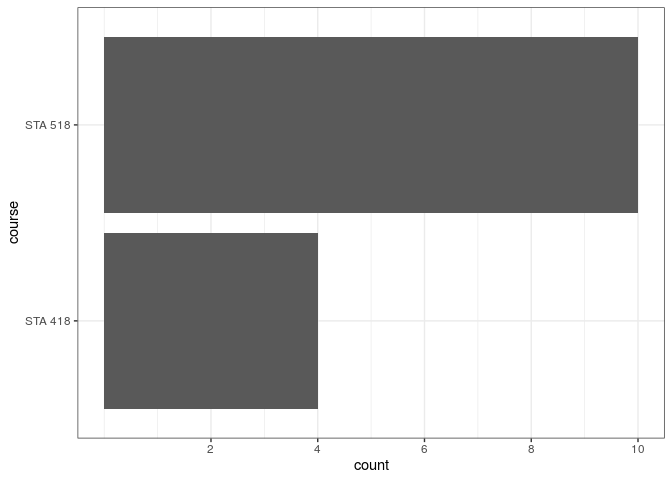
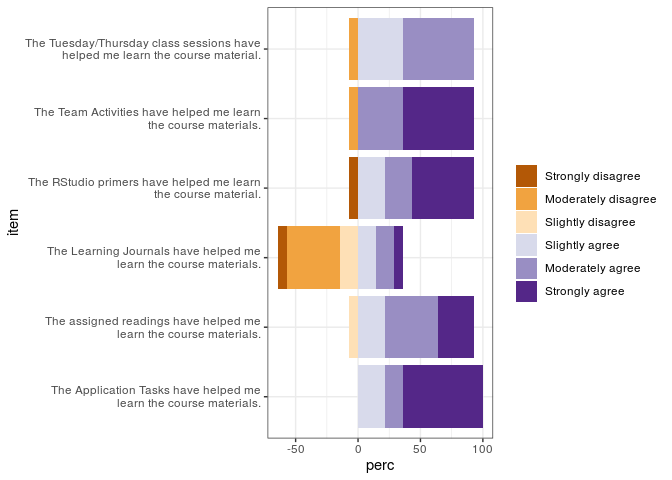
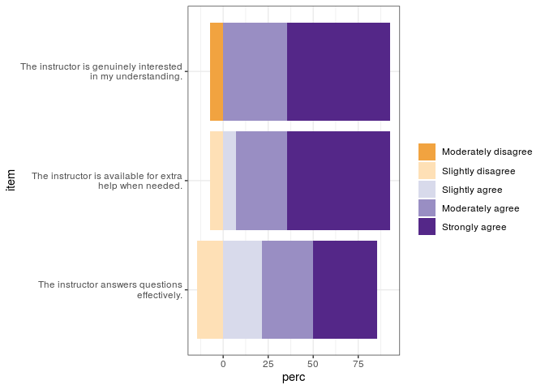
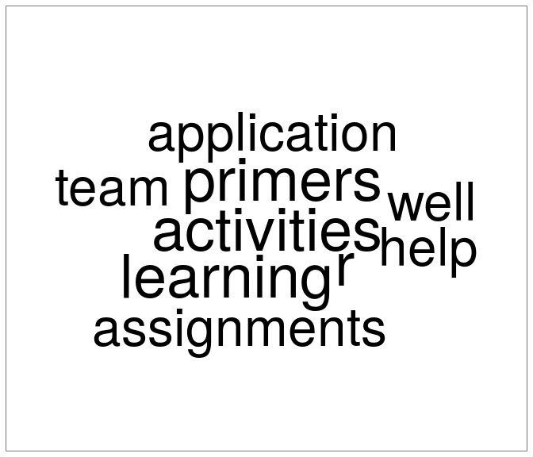
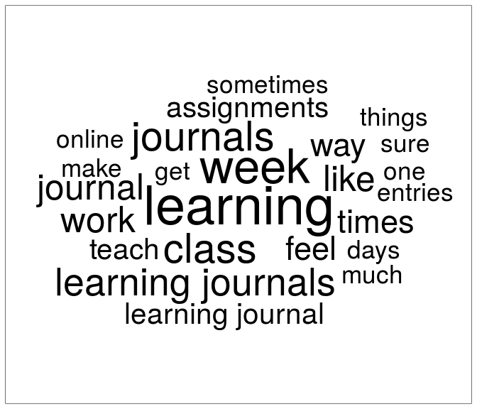
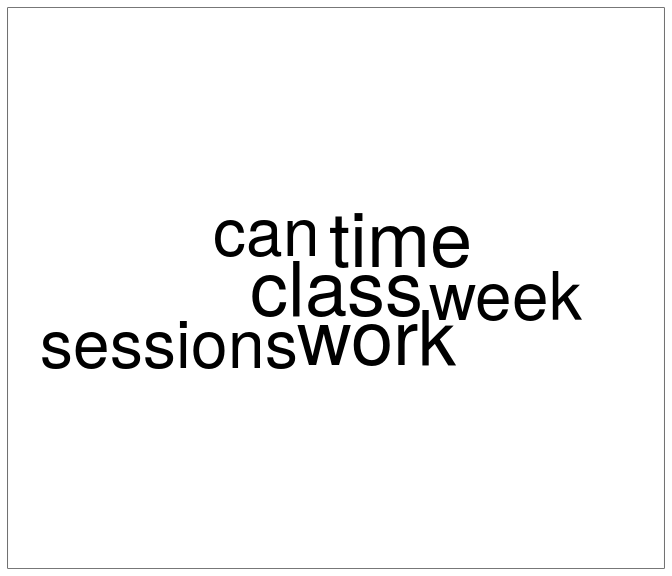

Early Course Evaluation - STA 418/518
================

## Preparing R

``` r
library(tidyverse)
```

    ## ── Attaching packages ─────────────────────────────────────────────────────────────────────── tidyverse 1.3.0 ──

    ## ✓ ggplot2 3.3.0     ✓ purrr   0.3.4
    ## ✓ tibble  3.0.1     ✓ dplyr   0.8.5
    ## ✓ tidyr   1.1.0     ✓ stringr 1.4.0
    ## ✓ readr   1.3.1     ✓ forcats 0.5.0

    ## ── Conflicts ────────────────────────────────────────────────────────────────────────── tidyverse_conflicts() ──
    ## x dplyr::filter() masks stats::filter()
    ## x dplyr::lag()    masks stats::lag()

``` r
library(RColorBrewer)
library(tidytext)
library(ggwordcloud)
```

``` r
## DO NOT RUN
# library(googledrive)
# library(googlesheets4)
# 
# drive_auth()
# 
# my_sheets <- drive_find(type = "spreadsheet")
# 
# sta518_sheet <- my_sheets %>% 
#   filter(str_detect(name, "SS20"))
# 
# sta518_evals <- read_sheet(sta518_sheet$id)
#
# write_csv(sta518_evals, here::here("data", "sta518_evals.csv"))

sta518_evals <- read_csv(here::here("data", "sta518_evals.csv"))
```

``` r
likert_scale <- c("Strongly disagree", "Moderately disagree", "Slightly disagree",
                  "Slightly agree", "Moderately agree", "Strongly agree")

likert_pallet <- RColorBrewer::brewer.pal(length(likert_scale), "PuOr")

# Lucy's hack!
likert_info <- tibble(
  scale = factor(likert_scale, levels = likert_scale),
  color = likert_pallet
)
```

## Course Response Breakdown

``` r
sta518_evals %>% 
  select(course = starts_with("In ")) %>% 
  ggplot(aes(y = course)) +
  geom_bar() +
  scale_x_continuous(breaks = c(2, 4, 6, 8, 10)) +
  theme_bw()
```

<!-- -->

## Course Design

``` r
# Rel freq table by likert response
course_design_summary <- sta518_evals %>% 
  select(starts_with("Course")) %>% 
  mutate_all(~factor(., level = likert_scale)) %>% 
  pivot_longer(everything(), names_to = "item", values_to = "response",
               names_pattern = "Course design \\[(.*)\\]") %>% 
  group_by(item, response) %>% 
  summarise(freq = n()) %>% 
  mutate(perc = freq / sum(freq) * 100)

# Add color column
course_design <- course_design_summary %>% 
  left_join(likert_info, by = c("response" = "scale"))

# Select only agrees
course_design_agree <- course_design %>% 
  filter(str_detect(response, " agree"))

# Select only disagrees
course_design_disagree <- course_design %>% 
  filter(!str_detect(response, " agree"))

# PLOT!!!!
ggplot() +
  geom_bar(data = course_design_agree, 
           aes(y = str_wrap(item, width = 40), x = perc, fill = color),
           position = "stack", stat = "identity") +
  geom_bar(data = course_design_disagree,
           aes(y = str_wrap(item, width = 40), x = -perc, fill = color),
           position = "stack", stat = "identity") +
  labs(y = "item") +
  scale_fill_identity("", labels = likert_scale, 
                      breaks = likert_pallet, guide = "legend") +
  theme_bw()
```

<!-- -->

## Instructor

``` r
instructor_summary <- sta518_evals %>% 
  select(starts_with("Instructor")) %>% 
  mutate_all(~factor(., levels = likert_scale)) %>% 
  pivot_longer(everything(), names_to = "item", values_to = "response",
               names_pattern = "Instructor \\[(.*)\\]") %>% 
  group_by(item, response) %>% 
  summarise(freq = n()) %>% 
  mutate(perc = round(freq / sum(freq) * 100, 1))

instructor <- instructor_summary %>% 
  select(-freq) %>% 
  left_join(likert_info, by = c("response" = "scale"))

instructor_agree <- instructor %>% 
  filter(str_detect(response, " agree"))

instructor_disagree <- instructor %>% 
  filter(!str_detect(response, " agree"))

ggplot() +
  geom_bar(data = instructor_agree,
           aes(y = str_wrap(item, width = 40), x = perc, fill = color),
           position = "stack", stat = "identity") +
  geom_bar(data = instructor_disagree,
           aes(y = str_wrap(item, width = 40), x = -perc, fill = color),
           position = "stack", stat = "identity") +
  scale_fill_identity("", labels = likert_scale, 
                      breaks = likert_pallet, guide = "legend") +
  theme_bw() +
  labs(y = "item")
```

<!-- -->

## Free response

### What has been the best aspect of this course so far?

``` r
best <- sta518_evals %>% 
  select(best = starts_with("What as")) %>% 
  mutate(individual = row_number()) %>% 
  unnest_tokens(bigram, best, token = "ngrams", n = 2)

best_sing <- sta518_evals %>% 
  select(starts_with("What as")) %>% 
  rename(best = starts_with("What as")) %>% 
  mutate(individual = row_number()) %>% 
  unnest_tokens(bigram, best) %>% 
  anti_join(get_stopwords(), by = c("bigram" = "word"))

best_sep <- best %>%
  separate(bigram, c("word1","word2"), sep = " ")

best_filtered <-  best_sep %>% 
  filter(!word1 %in% stop_words$word) %>% 
  filter(!word2 %in% stop_words$word)

best_cleaned <- best_filtered %>% 
  unite(bigram, word1, word2, sep = " ")

best_cleaned <- bind_rows(best_sing, best_cleaned)
```

``` r
best_cleaned %>%
  count(bigram, sort = TRUE) %>%
  filter(n > 2) %>% 
  ggplot(aes(label = bigram, size = n)) + 
  geom_text_wordcloud() +
  scale_size_area(max_size = 20) +
  theme_bw()
```

<!-- -->

### If there was one thing about this course that you would change?

``` r
change <- sta518_evals %>% 
  select(change = starts_with("If there")) %>% 
  mutate(individual = row_number()) %>% 
  unnest_tokens(bigram, change, token = "ngrams", n = 2)

change_sing <- sta518_evals %>%
  select(starts_with("If there")) %>% 
  rename(change = starts_with("If there")) %>% 
  mutate(individual = row_number()) %>% 
  unnest_tokens(bigram, change) %>% 
  anti_join(get_stopwords(), by = c("bigram" = "word"))

change_sep <- change %>%
  separate(bigram, c("word1","word2"), sep = " ")

change_filtered <-  change_sep %>% 
  filter(!word1 %in% stop_words$word) %>% 
  filter(!word2 %in% stop_words$word)

change_cleaned <- change_filtered %>% 
  unite(bigram, word1, word2, sep = " ")

change_cleaned <- bind_rows(change_sing, change_cleaned)
```

``` r
change_cleaned %>%
  count(bigram, sort = TRUE) %>%
  filter(n > 2) %>% 
  ggplot(aes(label = bigram, size = n)) + 
  geom_text_wordcloud() +
  scale_size_area(max_size = 20) +
  theme_bw()
```

<!-- -->

### What is one thing that you can do differently to improve your learning?

``` r
improve <- sta518_evals %>% 
  select(differently = starts_with("What is")) %>% 
  mutate(individual = row_number()) %>% 
  unnest_tokens(bigram, differently, token = "ngrams", n = 2)

improve_sing <- sta518_evals %>% 
  select(differently = starts_with("What is")) %>% 
  mutate(individual = row_number()) %>% 
  unnest_tokens(bigram, differently) %>% 
  anti_join(get_stopwords(), by = c("bigram" = "word"))

improve_sep <- improve %>%
  separate(bigram, c("word1","word2"), sep = " ")

improve_filtered <-  improve_sep %>% 
  filter(!word1 %in% stop_words$word) %>% 
  filter(!word2 %in% stop_words$word)

improve_cleaned <- improve_filtered %>% 
  unite(bigram, word1, word2, sep = " ")

improve_cleaned <- bind_rows(improve_sing, improve_cleaned)
```

``` r
improve_cleaned %>%
  count(bigram, sort = TRUE) %>%
  filter(n > 2) %>% 
  ggplot(aes(label = bigram, size = n)) + 
  geom_text_wordcloud() +
  scale_size_area(max_size = 20) +
  theme_bw()
```

<!-- -->
